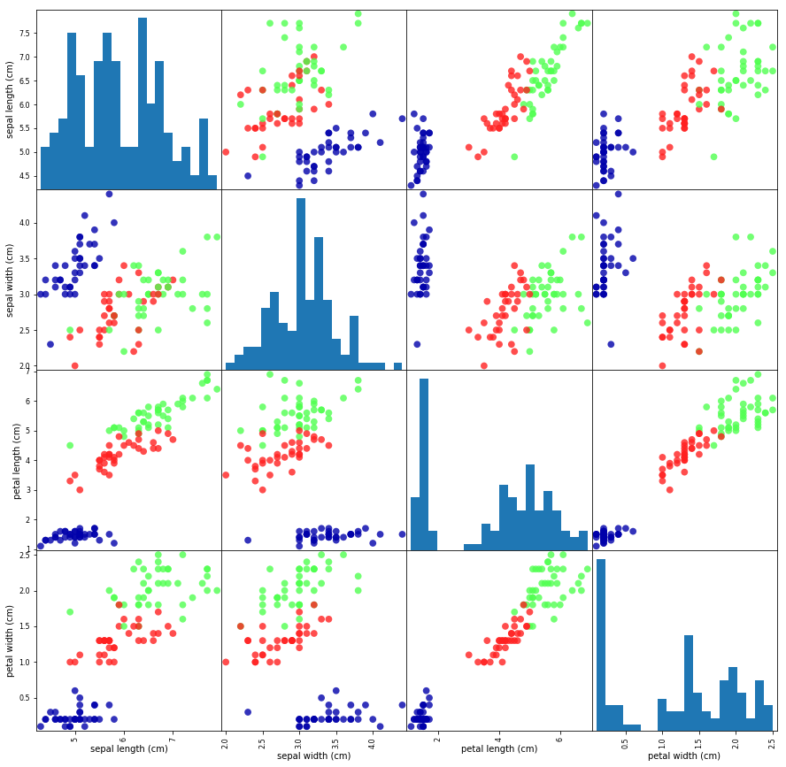

```python
import pandas as pd
import sys
import matplotlib
import numpy as np
import scipy as sp
import IPython
import sklearn
import mglearn
```


```python
from sklearn.datasets import load_iris
iris_dataset = load_iris()

print("Keys of iris_dataset: \n{}".format(iris_dataset.keys()))
```

    Keys of iris_dataset: 
    dict_keys(['data', 'target', 'target_names', 'DESCR', 'feature_names'])
    


```python
print(iris_dataset['DESCR'][:977] + "\n...")
```

    Iris Plants Database
    ====================
    
    Notes
    -----
    Data Set Characteristics:
        :Number of Instances: 150 (50 in each of three classes)
        :Number of Attributes: 4 numeric, predictive attributes and the class
        :Attribute Information:
            - sepal length in cm
            - sepal width in cm
            - petal length in cm
            - petal width in cm
            - class:
                    - Iris-Setosa
                    - Iris-Versicolour
                    - Iris-Virginica
        :Summary Statistics:
    
        ============== ==== ==== ======= ===== ====================
                        Min  Max   Mean    SD   Class Correlation
        ============== ==== ==== ======= ===== ====================
        sepal length:   4.3  7.9   5.84   0.83    0.7826
        sepal width:    2.0  4.4   3.05   0.43   -0.4194
        petal length:   1.0  6.9   3.76   1.76    0.9490  (high!)
        petal width:    0.1  2.5   1.20  0.76     0.9565  (high!)
        ============== ==== ==== ======= ===== ================
    ...
    


```python
print("target names: {}".format(iris_dataset['target_names'])) 
```

    target names: ['setosa' 'versicolor' 'virginica']
    


```python
print("feature names: {}".format(iris_dataset['feature_names'])) 
```

    feature names: ['sepal length (cm)', 'sepal width (cm)', 'petal length (cm)', 'petal width (cm)']
    


```python
print("Type of data: {}".format(type(iris_dataset['data'])))
```

    Type of data: <class 'numpy.ndarray'>
    


```python
print("Shape of data: {}".format(iris_dataset['data'].shape)) 
```

    Shape of data: (150, 4)
    


```python
print("First few colombs of dataset:\n{}".format(iris_dataset['data'][:5])) 
```

    First few colombs of dataset:
    [[5.1 3.5 1.4 0.2]
     [4.9 3.  1.4 0.2]
     [4.7 3.2 1.3 0.2]
     [4.6 3.1 1.5 0.2]
     [5.  3.6 1.4 0.2]]
    


```python
print("Type of target: {}".format(type(iris_dataset['target'])))
```

    Type of target: <class 'numpy.ndarray'>
    


```python
print("target:\n{}".format(iris_dataset['target']))
```

    target:
    [0 0 0 0 0 0 0 0 0 0 0 0 0 0 0 0 0 0 0 0 0 0 0 0 0 0 0 0 0 0 0 0 0 0 0 0 0
     0 0 0 0 0 0 0 0 0 0 0 0 0 1 1 1 1 1 1 1 1 1 1 1 1 1 1 1 1 1 1 1 1 1 1 1 1
     1 1 1 1 1 1 1 1 1 1 1 1 1 1 1 1 1 1 1 1 1 1 1 1 1 1 2 2 2 2 2 2 2 2 2 2 2
     2 2 2 2 2 2 2 2 2 2 2 2 2 2 2 2 2 2 2 2 2 2 2 2 2 2 2 2 2 2 2 2 2 2 2 2 2
     2 2]
    


```python
from sklearn.model_selection import train_test_split

X_train, X_test, y_train, y_test = train_test_split(
    iris_dataset['data'], iris_dataset['target'], random_state=0)

print("X_train shape: {}".format(X_train.shape))
print("y_train shape: {}".format(y_train.shape))
```

    X_train shape: (112, 4)
    y_train shape: (112,)
    


```python
print("X_train shape: {}".format(X_test.shape))
print("y_train shape: {}".format(y_test.shape))
```

    X_train shape: (38, 4)
    y_train shape: (38,)
    


```python
#X_train dataframe
iris_dataframe = pd.DataFrame(X_train, columns=iris_dataset.feature_names)

#scattermatrix from dataframe

grr = pd.scatter_matrix(iris_dataframe, c=y_train, figsize=(15, 15), marker='o',
                      hist_kwds={'bins' : 20}, s=60, alpha=.8, cmap=mglearn.cm3)
```

    C:\ProgramData\Anaconda3\lib\site-packages\ipykernel_launcher.py:7: FutureWarning: pandas.scatter_matrix is deprecated, use pandas.plotting.scatter_matrix instead
      import sys
    





```python
#Training on dataset

from sklearn.neighbors import KNeighborsClassifier

knn = KNeighborsClassifier(n_neighbors=1)
knn.fit(X_train, y_train)
```


    KNeighborsClassifier(algorithm='auto', leaf_size=30, metric='minkowski',
               metric_params=None, n_jobs=1, n_neighbors=1, p=2,
               weights='uniform')


```python
#Now we can make prediction using the trained model

X_new = np.array([[7.9, 4.4, 6.9, 2.5]])
print("X_new.shape: {}".format(X_new.shape))

```

    X_new.shape: (1, 4)
    


```python
#Making new pridiction by pasing in data as a varible i.e. X_new in the form of the numpy array above.


prediction = knn.predict(X_new)
print("Prediction: {}".format(prediction))
print("Predicted target name: {}".format(
        iris_dataset['target_names'][prediction]))
```

    Prediction: [2]
    Predicted target name: ['virginica']
    


```python
y_pred = knn.predict(X_test)
print("Test set predictions:\n {}".format(y_pred))
```

    Test set predictions:
     [2 1 0 2 0 2 0 1 1 1 2 1 1 1 1 0 1 1 0 0 2 1 0 0 2 0 0 1 1 0 2 1 0 2 2 1 0
     2]
    


```python
print("Test score: {:.2f}".format(np.mean(y_pred == y_test)))
```

    Test score: 0.97
    


```python
print("test score: {:.2f}".format(knn.score(X_test, y_test)))
```

    test score: 0.97
    
